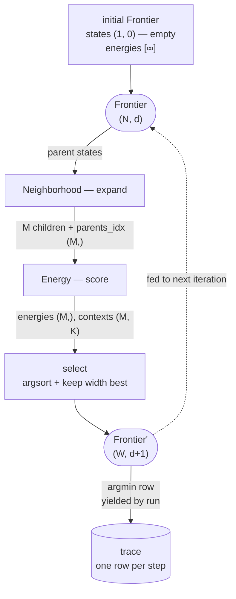

edmkit-search is one loop. From a current **frontier** of candidate states, the loop:

1. **Expands** each parent into children — a `Neighborhood`.
2. **Scores** the children — an `Energy`.
3. **Keeps** the survivors as the next frontier — a `Strategy`.

The trajectory of "best survivor per step" *is* the output. There is no separate fit/predict phase — every step already produces a usable state. Read the validation curve to choose where to stop (see [Validation](/edmkit-search/concepts/validation/)).

## Why three pieces

Research runs typically compare scorers (`holdout` vs `loo` vs `folds`), selection policies (greedy vs beam), and sometimes expansions (forward vs backward vs swap). A monolithic loop forces a new implementation per comparison. edmkit-search instead decomposes the loop into three plain callables: **fix two, vary the third, plot the curves on the same axes.** Parallelism is the fourth axis you control — the library never imports `concurrent.futures`.

## The loop, in code

The loop carries one piece of state: a frozen `Frontier`.

```python
@dataclass(frozen=True)
class Frontier:
    states: States      # (N, d) — N candidates, each d indices into the dataset
    contexts: Contexts  # (N, K) — energy-side data threaded between steps
    energies: Energies  # (N,)   — score per candidate (lower is better)
```

The three arrays are aligned along the leading axis. Every step produces a fresh frontier.

A step is what a `Strategy` *is*. The body of `beam` reduces to:

```python
def step(frontier: Frontier, rng: np.random.Generator) -> Frontier:
    children, parents_idx = N(frontier.states, rng)              # (M, d+1), (M,)
    energies, contexts = E(children, frontier.contexts[parents_idx])  # (M,), (M, K)
    order = np.argsort(energies, kind="stable")[:width]          # keep best `width`
    return Frontier(children[order], contexts[order], energies[order])
```

The runtime cost lives entirely inside `E(...)`. Everything around it is index gymnastics.

`strategy.run` drives this step from an initial frontier up to `max_steps` times. After every step it yields the *single* lowest-energy survivor as a one-row frontier; the *full* post-step frontier is threaded into the next iteration internally.



For the standard [`forward`](/edmkit-search/concepts/neighborhood/) neighborhood, each iteration grows `d` by 1. Starting from `(1, 0)`, **`trace[j].states[0]` is the selected index set of length `j + 1`**. The iterator stops early when a step returns an empty frontier or after `max_steps` iterations.

## The three signatures

| Axis | Signature | Built-ins |
| ---- | --------- | --------- |
| **Neighborhood** | `(parents, rng) -> (children, parents_idx)` | `forward(n)` |
| **Energy** | `(states, contexts) -> (energies, contexts')` | `holdout`, `loo`, `folds` |
| **Strategy** | `Step = (Frontier, rng) -> Frontier'` | `greedy`, `beam(width=W)` |

There is no base class. The three are plain callable protocols (and one frozen `dataclass`).

## State is an integer array

A `State` is a 1D `int64` ndarray — the selected columns of `X`. A batch is `States` of shape `(N, d)`; `state.initial()` returns the empty `(1, 0)` batch.

:::note[The search does not lag-embed]
Each selected column contributes exactly **one** dimension to the state vector at time `t`. To lag-embed, do it upstream — fold lagged copies into `X` as extra columns, or pre-process with [`edmkit.embedding.lagged_embed`](https://fujishigetemma.github.io/edmkit/reference/embedding/) before constructing the `Dataset`.
:::

