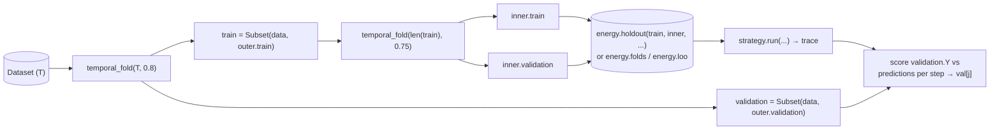

A search that minimizes its own scoring metric will eventually overfit. Two practices keep it honest:

1. **Two-level fold structure.** Reserve one held-out arm *outside* the search loop entirely. The **inner-fold arm** is what the energy sees; the **outer-fold arm** is what you score against after the search finishes.
2. **Read the trajectory as a curve.** Pair the inner-fold energy with an outer-fold score per step and plot both against step number.

With the outer fold held fixed across runs, different `(metric, energy, strategy)` configurations are directly comparable. `Subset` is non-copying, so this structure is essentially free.

## The two-level recipe



Two folds, two jobs:

- **Outer fold** (`outer.train` / `outer.validation`) — the search's *world* and *exam*. The validation arm is touched exactly once, at the end, to score the trace.
- **Inner fold(s)** (built from `train` only) — the data the **Energy** sees during search. `energy.holdout` uses one fold; `energy.folds` uses several sliding folds; `energy.loo` uses none.

If the search peeks at the outer arm, the per-step validation curve stops being an unbiased estimate of generalization.

## Reading the trace

`strategy.run` yields one frontier per step. The single-row `Frontier` carries the search's *training-side* energy in `energies[0]`. Score the same indices against the outer validation arm to get the *generalization-side* number:

```python
predictions = np.zeros((len(trace), *validation.Y.shape))
for j in range(len(trace)):
    selected = trace[j].states[0]
    predictions[j] = simplex_projection(
        train.X[:, selected], train.Y, validation.X[:, selected]
    ).reshape(validation.Y.shape)
val = corr(predictions, np.broadcast_to(validation.Y, predictions.shape))

# Two aligned arrays, both indexed by step `j`:
#   trace[j].energies[0]   — inner-fold energy (what the search optimized)
#   val[j]                 — outer-fold score   (the honest number)
```

Both are "lower is better." Patterns to recognize:

| Pattern | Likely meaning |
| ------- | -------------- |
| Training decreases, validation tracks it, then validation flattens | Reached the informative subset; further additions are noise. |
| Training decreases, validation **rises** after step `k` | Classic overfit. `k` is the natural stopping point. |
| Training and validation both jagged | Energy is too noisy — try a wider beam, more folds, or a coarser horizon. |
| Validation lower than training at low `d` | Inner fold is small or unrepresentative — increase inner-train ratio or switch to `folds`. |

Model selection is `best_step = int(np.argmin(val))`; the reported subset is `trace[best_step].states[0]`.

## The sweep template

A single run is a starting point, not an answer. Swap one axis at a time and compare per-step validation curves directly. The template below mirrors the configuration grid in [`edmkit-search-experiments`](https://github.com/FujishigeTemma/edmkit-search-experiments): three metrics × five energies × two strategies = thirty trajectories on the same outer fold.

The sweep wraps the canonical `Energy` closure (see [Energy → The canonical closure](/edmkit-search/concepts/energy/#the-canonical-closure)) as a small factory `to_energy(initial_context, plan, pool)` so each `(metric, energy)` pair can reuse the same pool. Requires free-threaded Python — see [Getting Started → Installation](/edmkit-search/getting-started/#installation).

```python
import os
from concurrent.futures import ThreadPoolExecutor

import numpy as np
from edmkit.metrics import mae, mean_rho, rmse
from edmkit.simplex_projection import simplex_projection
from edmkit.splits import sliding_folds, temporal_fold

from edmkit.search import energy, neighborhood, state, strategy
from edmkit.search.dataset import Dataset, Subset


def corr(predictions, observations):
    return 1.0 - mean_rho(predictions.reshape(observations.shape), observations)


# Outer fold — fixed across the whole sweep.
data = Dataset(X=X_full, Y=Y_full)
outer = temporal_fold(data.X.shape[0], 0.8)
train = Subset(data, outer.train)
validation = Subset(data, outer.validation)

# Inner splits — fixed for the metric & energy axes.
inner = temporal_fold(train.X.shape[0], 0.75)

T_train = train.X.shape[0]
inner_folds = sliding_folds(
    T_train,
    train_size=int(T_train * 0.4),
    validation_size=int(T_train * 0.2),
    stride=int(T_train * 0.2),
)

def to_energy(initial_context, plan, pool):
    K = initial_context.shape[1]
    def E(states, contexts):
        futures = [pool.submit(job) for job in plan(states, contexts)]
        n = states.shape[0]
        energies = np.empty(n, dtype=np.float64)
        new_contexts = np.empty((n, K), dtype=np.float64)
        for f in futures:
            s, e, c = f.result()
            energies[s] = e
            new_contexts[s] = c
        return energies, new_contexts
    return E


results = []
with ThreadPoolExecutor(max_workers=os.cpu_count()) as pool:
    N = neighborhood.forward(data.X.shape[1])

    for metric_label, metric in [("Corr", corr), ("MAE", mae), ("RMSE", rmse)]:
        energies = [
            ("holdout",       energy.holdout(data=train, fold=inner, predict=simplex_projection, metric=metric, batch_size=2500)),
            ("folds (T=0.1)", energy.folds(data=train, folds=inner_folds, predict=simplex_projection, metric=metric, weight=energy.weight.softmax(0.1), batch_size=2000)),
            ("folds (T=1)",   energy.folds(data=train, folds=inner_folds, predict=simplex_projection, metric=metric, weight=energy.weight.softmax(1.0), batch_size=2000)),
            ("folds (T=10)",  energy.folds(data=train, folds=inner_folds, predict=simplex_projection, metric=metric, weight=energy.weight.softmax(10.0), batch_size=2000)),
            ("loo",           energy.loo(data=train, metric=metric, batch_size=4000)),
        ]

        for energy_label, (initial_context, plan) in energies:
            E = to_energy(initial_context, plan, pool)

            for strategy_label, S in [
                ("greedy", strategy.greedy(E, N)),
                ("beam",   strategy.beam(E, N, width=3)),
            ]:
                initial = strategy.Frontier(
                    states=state.initial(),
                    contexts=initial_context,
                    energies=np.array([float("inf")], dtype=np.float64),
                )
                trace = list(strategy.run(initial, S, max_steps=10, rng=np.random.default_rng(0)))

                predictions = np.zeros((len(trace), *validation.Y.shape))
                for j in range(len(trace)):
                    selected = trace[j].states[0]
                    predictions[j] = simplex_projection(
                        train.X[:, selected], train.Y, validation.X[:, selected]
                    ).reshape(validation.Y.shape)
                val = metric(predictions, np.broadcast_to(validation.Y, predictions.shape))

                for j in range(len(trace)):
                    results.append({
                        "metric": metric_label,
                        "energy": energy_label,
                        "strategy": strategy_label,
                        "step": j,
                        "selected": trace[j].states[0].tolist(),
                        "train": float(trace[j].energies[0]),
                        "validation": float(val[j]),
                    })
```

Because the outer fold and inner splits are fixed outside all loops, every row of `results` is scored on the same `validation` arm and every energy sees the same inner geometry — strategy differences are selection policy alone. Loading `results` into a DataFrame and plotting `validation` against `step`, grouped by `(metric, energy, strategy)`, is the canonical visualisation.

## When to swap which axis

| You want to know | Fix | Vary |
| ---------------- | --- | ---- |
| Is my selected subset stable across loss choices? | energy, strategy | metric |
| Is the inner-fold geometry biasing the search? | metric, strategy | energy (`holdout` vs `folds`, vary `T`) |
| Is the search committing too early? | metric, energy | strategy (`greedy` vs `beam(width=W)`) |
| Is my neighborhood the bottleneck? | metric, energy, strategy | neighborhood (custom expander) |

